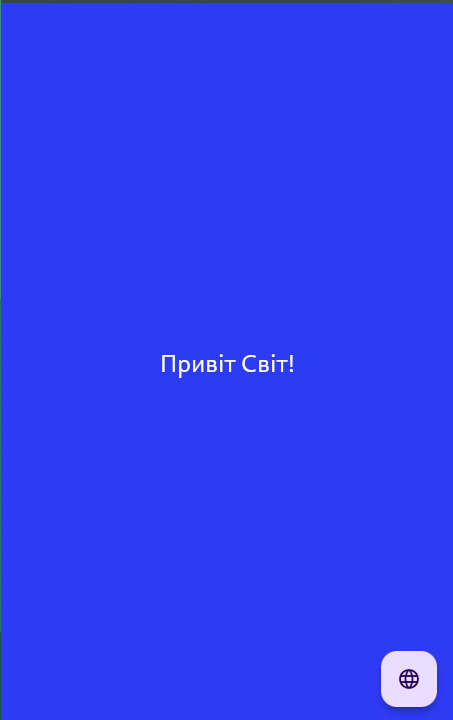
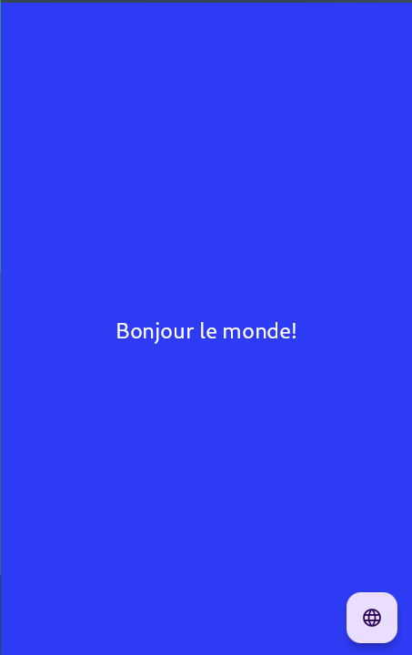

## Test task for the position of Junior Flutter Developer

### Task description
The task involves the development of a rudimentary Flutter application. The application should display the text "Hello World!" centrally on the screen. Upon interaction with the screen, the application is expected to dynamically change the background color to a color selected at random. As a developer, I am permitted to incorporate any additional functionality into the application that I deem necessary. Please note that the background color must be changed **without** the use of any external libraries.

App should be developed using the latest stable version of Flutter. The application code should use linting from [Solid](https://pub.dev/packages/solid_lints) package. Code base should follow DRY and KISS principles.

### Solution

1. First how to generate a random color in Flutter. 
```dart
import 'dart:math';

// generate random color using Random class and HSV color model
Color randomColor() {
  return Color((Random().nextDouble() * 0xFFFFFF).toInt() << 0)
          .withOpacity(1.0);
}
```
But if text color is white and background color is white, the text will be invisible. So we should change color of the text if the background color is too light. We can use `brightness` property of the `Color` class to check if the color is too light or too dark. If the color is too light we should change the text color to black. 
```dart
Color textColor(Color color) {
  return color.computeLuminance() > 0.5 ? Colors.black : Colors.white;
}
```

2. Okay now we have algorithm to generate random color. But how to change bg color of the application by tapping on the any part of the screen. Solution is very simple. We should use `Stack` where first child is `GestureDetector` with `Container` and second child is `Text`.
3. Now we have to change the color of the `Container` by tapping on the screen. We can use `setState` to change the color of the `Container` by tapping on the screen.

So.... But this looks so stinky. We can use `AnimatedContainer` to change the color of the `Container` with animation. 

But this is very simple. And for make this task more interesting I will use `Cubit` from `bloc` for handle the locale state of the application.

Application support this locales:
- English
- Español
- Ukrainian
- French
- Italian

For add localization to the application I have to use `flutter_localizations` package. And follow the [documentation](https://flutter.dev/docs/development/accessibility-and-localization/internationalization) to add localization to the application.

### Screenshots
| English                        | Español                        | Ukrainian                        | French                        | Italian                        |
| ------------------------------ | ------------------------------ | -------------------------------- | ----------------------------- | ------------------------------ |
|  |  |  |  |  |

### How to run the application
1. Clone the repository
```bash
git clone https://github.com/hikionori/solid_test.git
```
2. Go to the project directory
```bash
cd solid_test
```
3. Get the dependencies
```bash
flutter pub get
```
4. Run the application
```bash
flutter run
```